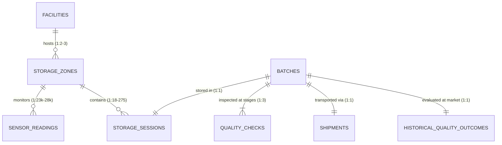

# VDR-01 Dataset Inventory and Relational Integrity

## Executive summary

This report establishes the baseline dataset inventory, physical schema, grain, relational topology, referential integrity, and data quality characteristics for the **Smart Harvest: Reduce Post-Harvest Losses** challenge dataset (`Slave-of-Skynet/training_agrifood`). All findings in this document derive from direct programmatic measurement of the supplied sponsor files rather than from unverified claims in documentation.

### Key Inventory and Scale Findings
- **File Scale**: The dataset comprises eight (8) CSV files totaling **54,141,891 bytes** (~51.63 MiB) and one Excel data dictionary (`data_dictionary.xlsx`, **10,088 bytes**).
- **Record Scale**: The dataset tracks **10 facilities**, **25 storage zones**, **1,800 crop batches**, **1,800 storage sessions**, **669,665 environmental sensor readings**, **5,400 physical quality inspections**, **1,800 transport shipments**, and **1,800 historical quality outcomes**.
- **Temporal Span**: Harvest dates span from **2024-05-20 07:30:00** to **2025-10-25 14:45:00**. Storage sessions span entry from **2024-05-20 12:05:24** to dispatch on **2026-04-03 12:30:36**. Sensor telemetry spans from **2024-05-19 00:00:00** to **2025-12-31 23:30:00**.

### Relational Topology & Referential Integrity
- **Relational Cleanliness**: Primary key uniqueness is **100.0%** across all eight tables (zero duplicate primary keys). Foreign key integrity is **100.0%** across all explicit relational links (zero orphan records, zero missing referenced parents).
- **Core 1:1 Batch Grain**: The entities `batches`, `storage_sessions`, `shipments`, and `historical_quality_outcomes` exist in a strict **1:1:1:1** cardinality relationship. Every batch has exactly one storage session, exactly one shipment record, and exactly one final outcome record. No batch was moved across multiple chambers or split across multiple shipments.
- **Strict 1:3 Inspection Cadence**: `quality_checks` contains exactly three inspections per batch: one at `harvest`, one at `pre_dispatch`, and one at `arrival`.
- **Spatio-Temporal Telemetry Join**: `sensor_readings` does not contain a `batch_id` or `storage_session_id`. Telemetry joins to storage activity strictly through compound spatio-temporal interval logic: `sensor_readings.zone_id = storage_sessions.zone_id` where `sensor_readings.timestamp` falls between `storage_sessions.entry_datetime` and `storage_sessions.dispatch_datetime`.

### Critical Quality Anomalies and Defects
1. **Systemic Telemetry Truncation (Confirmed Defect)**: Sensor telemetry terminates abruptly on **2025-12-31 23:30:00**, while **204 batches** (11.33% of all batches) remain in cold storage into 2026 (up to **2026-04-03 12:30:36**). These 204 batches are missing between 0.55 and 92.54 days (mean 29.01 days) of environmental telemetry immediately preceding their dispatch assessment moment $T_{dispatch}$.
2. **Zone-006 Missing Surface Temperature Channel (Confirmed Missing Channel)**: In chamber `ZONE-006` (a Controlled Atmosphere chamber), 100% of readings (**28,366 readings**) have `NULL` for `produce_surface_temperature_c`. In all other 24 chambers, surface temperature is 100% non-null. *(Fact: 28,366 null values exclusively in ZONE-006. Inference / simulation hypothesis: consistent with an unmonitored channel or simulated probe failure).*
3. **CA Gas Sensor Systemic Nulls (Confirmed Structural Feature)**: `co2_ppm` and `o2_pct` are populated exclusively in the five (5) Controlled Atmosphere (CA) rooms (136,522 readings, 0% null). In all other 20 standard, pre-cooling, and fresh produce rooms, both gas measurements are **100% NULL** (**533,143 nulls**). *(Fact: 533,143 nulls in 20 non-CA chambers. Documentation claim: gas concentrations monitored for CA rooms. Inference: conventional chambers lack gas sensors or do not record gas telemetry).*
4. **Massive Chamber Sharing & Nominal Capacity Exceedance (Observed Phenomenon / Inferred Artifact)**: **1,734 out of 1,800 batches** (96.33%) concurrently share cold storage rooms with at least one other batch (averaging 11.97 batches and up to 114 batches sharing identical telemetry pings). In 792 instances (measured at batch entry times), the total stored tonnage in a chamber exceeds its nominal room capacity (80–120 tonnes), peaking at 1,090.1 tonnes (9.08× nominal capacity). *(Fact: concurrent batch tonnage exceeds nominal capacity in 792 entry instances. Inference: chamber capacity constraints were unenforced during batch simulation scheduling).*
5. **Deterministic Outcome Thresholds**: Ground truth `quality_status` in `historical_quality_outcomes.csv` is 100% deterministically derived from `loss_fraction_pct`: `optimal` (<5%), `degraded` ([5%, 15%)), `severe_degradation` ([15%, 35%)), and `lost` (≥35%). Financial loss follows `round(loss_fraction_pct / 100 * harvest_weight_kg * price_per_kg, 2)` across fixed per-crop prices.

---

## Source files inspected

The following files within the repository workspace (`C:\Users\victo\.gemini\antigravity\scratch\training_agrifood`) were inspected:

### Primary Data Sources
1. `sponsor_pack/data/facilities.csv` (869 bytes)
2. `sponsor_pack/data/storage_zones.csv` (2,529 bytes)
3. `sponsor_pack/data/batches.csv` (163,479 bytes)
4. `sponsor_pack/data/storage_sessions.csv` (174,934 bytes)
5. `sponsor_pack/data/sensor_readings.csv` (53,087,361 bytes)
6. `sponsor_pack/data/quality_checks.csv` (360,451 bytes)
7. `sponsor_pack/data/shipments.csv` (278,921 bytes)
8. `sponsor_pack/data/historical_quality_outcomes.csv` (73,347 bytes)
9. `sponsor_pack/data/data_dictionary.xlsx` (10,088 bytes; SHA-256: `08e88f4e835b1d0679daa8fa625c63c25082159ad9adf74fa23c958ee1b72829`, Git blob: `776b0e543ba782c7fb3aa17dbec03617b50c4767`)

> **Provenance Note**: All 11 files under `sponsor_pack/` were independently verified against base commit `72ab453f52d3bb7909001d0403fc62f89dce117d`. Diff is empty (0 lines changed), and all git object blob hashes match the base commit tree exactly.

### Canonical Documentation & Context
10. `sponsor_pack/README.md`
11. `sponsor_pack/brief/Training Challenge #3 — AgriFood.md`
12. `docs/challenge_canon.md`
13. `docs/assumptions_unknowns.md`
14. `docs/data_contract.md`
15. `docs/evaluation.md`

---

## Dataset inventory

### Table 1: `facilities.csv`
- **File size**: 869 bytes
- **Row count**: 10
- **Column count**: 8
- **Apparent row grain**: One physical post-harvest facility / enterprise commercial site
- **Candidate primary key**: `facility_id` (Unique: Yes; Nulls: 0; Duplicates: 0)
- **Foreign-key-like fields**: None (root entity)
- **Duplicate row count**: 0
- **Timestamp ranges**: None (contains `commissioned_year`: [2012, 2022], mean 2017.8)
- **Exact Schema & Data Profile**:

| Column Name | Observed Type | Null Count | Null % | Value Summary / Categories / Ranges |
| :--- | :--- | :--- | :--- | :--- |
| `facility_id` | string | 0 | 0.0% | 10 unique IDs (`FAC-001` to `FAC-010`) |
| `facility_name` | string | 0 | 0.0% | 10 unique names: `Briceni FruitLog`, `Cahul FrigoPort`, `Chișinău Central Cold`, `Codru AgroTerm`, `Comrat FruitLogistics`, `Edineț AgroStore`, `Ialoveni AgroDepot`, `NordFrigo Hub`, `Orhei FructStore`, `Taraclia SouthCold` |
| `region` | string | 0 | 0.0% | `Centre` (4), `North` (3), `South` (3) |
| `district` | string | 0 | 0.0% | 10 districts: `Briceni`, `Bălți`, `Cahul`, `Chișinău`, `Comrat`, `Edineț`, `Ialoveni`, `Orhei`, `Strășeni`, `Taraclia` |
| `facility_type` | string | 0 | 0.0% | `Commercial Cold Store` (4), `Packinghouse` (3), `Cooperative Hub` (2), `Distribution Center` (1) |
| `capacity_tonnes` | integer | 0 | 0.0% | min: 2,500, max: 6,000, mean: 3,710.0 |
| `commissioned_year`| integer | 0 | 0.0% | min: 2012, max: 2022, mean: 2017.8 |
| `has_controlled_atmosphere` | boolean | 0 | 0.0% | `True` (5), `False` (5) |

---

### Table 2: `storage_zones.csv`
- **File size**: 2,529 bytes
- **Row count**: 25
- **Column count**: 10
- **Apparent row grain**: One individual cold storage chamber / refrigerated room within a facility
- **Candidate primary key**: `zone_id` (Unique: Yes; Nulls: 0; Duplicates: 0)
- **Foreign-key-like fields**: `facility_id` (FK -> `facilities.facility_id`)
- **Duplicate row count**: 0
- **Timestamp ranges**: None
- **Exact Schema & Data Profile**:

| Column Name | Observed Type | Null Count | Null % | Value Summary / Categories / Ranges |
| :--- | :--- | :--- | :--- | :--- |
| `zone_id` | string | 0 | 0.0% | 25 unique IDs (`ZONE-001` to `ZONE-025`) |
| `facility_id` | string | 0 | 0.0% | References 10 facilities (2 to 3 zones per facility) |
| `zone_name` | string | 0 | 0.0% | 4 distinct chamber labels: `Chamber 2 (Std)` (10), `Chamber 1 (CA)` (5), `Chamber 1 (Std)` (5), `Chamber 3 (Std)` (5) |
| `zone_type` | string | 0 | 0.0% | `Standard Cold Room` (9), `Vegetable & Fresh Produce Room` (6), `Controlled Atmosphere (CA)` (5), `Rapid Pre-Cooling` (5) |
| `nominal_capacity_tonnes` | integer | 0 | 0.0% | min: 80, max: 120, mean: 97.6 (values: 80, 100, 120) |
| `target_temperature_c` | float | 0 | 0.0% | min: 0.5°C, max: 11.0°C, mean: 3.50°C |
| `target_relative_humidity_pct` | float | 0 | 0.0% | min: 90.0%, max: 94.0%, mean: 91.16% |
| `cooling_system_type` | string | 0 | 0.0% | `Ammonia Secondary` (9), `Propane Chiller` (8), `R134a DX` (8) |
| `insulation_quality` | string | 0 | 0.0% | `Premium` (9), `High` (8), `Standard` (8) |
| `defrost_cycle_frequency_per_day` | integer | 0 | 0.0% | min: 1, max: 2, mean: 1.68 (`1` cycle: 8 rooms, `2` cycles: 17 rooms) |

---

### Table 3: `batches.csv`
- **File size**: 163,479 bytes
- **Row count**: 1,800
- **Column count**: 10
- **Apparent row grain**: One harvested agricultural lot/batch of produce
- **Candidate primary key**: `batch_id` (Unique: Yes; Nulls: 0; Duplicates: 0)
- **Foreign-key-like fields**: None directly stored (acts as central entity)
- **Duplicate row count**: 0
- **Timestamp ranges**: `harvest_datetime`: [2024-05-20 07:30:00, 2025-10-25 14:45:00]
- **Exact Schema & Data Profile**:

| Column Name | Observed Type | Null Count | Null % | Value Summary / Categories / Ranges |
| :--- | :--- | :--- | :--- | :--- |
| `batch_id` | string | 0 | 0.0% | 1,800 unique IDs (`BAT-000001` to `BAT-001800`) |
| `crop_type` | string | 0 | 0.0% | 8 crops: `apples` (673), `plums` (350), `table_grapes` (310), `tomatoes` (180), `pears` (114), `strawberries` (63), `apricots` (60), `raspberries` (50) |
| `variety` | string | 0 | 0.0% | 34 cultivar varieties (e.g. `Idared`: 139, `Granny Smith`: 122, `Golden Delicious`: 117, `Gala`: 112, `Kabardinka`: 104, `Jonagold`: 97, `Anna Späth`: 89, `Codreanca`: 89, `Victoria`: 88, `Fuji`: 86, `Stanley`: 75, `Moldova`: 67) |
| `origin_region` | string | 0 | 0.0% | `North` (809), `Centre` (587), `South` (404) |
| `harvest_datetime` | timestamp | 0 | 0.0% | min: `2024-05-20 07:30:00`, max: `2025-10-25 14:45:00` |
| `harvest_weight_kg`| float | 0 | 0.0% | min: 533.40 kg, max: 14,986.30 kg, mean: 6,851.80 kg |
| `initial_quality_score` | float | 0 | 0.0% | min: 78.80, max: 99.00, mean: 91.01 |
| `harvest_temperature_c` | float | 0 | 0.0% | min: -0.40°C, max: 36.50°C, mean: 18.48°C |
| `harvest_conditions` | string | 0 | 0.0% | `Optimal Dry` (1,299), `Humid` (288), `Hot / Sun-Exposed` (164), `Post-Rain` (49) |
| `field_precooled` | boolean | 0 | 0.0% | `False` (981), `True` (819) |

---

### Table 4: `storage_sessions.csv`
- **File size**: 174,934 bytes
- **Row count**: 1,800
- **Column count**: 8
- **Apparent row grain**: One continuous cold storage stay for a specific batch in a single chamber
- **Candidate primary key**: `storage_session_id` (Unique: Yes; Nulls: 0; Duplicates: 0)
- **Foreign-key-like fields**: `batch_id` (FK -> `batches.batch_id`), `zone_id` (FK -> `storage_zones.zone_id`)
- **Duplicate row count**: 0
- **Timestamp ranges**: 
  - `entry_datetime`: [2024-05-20 12:05:24, 2025-10-25 18:30:00]
  - `dispatch_datetime`: [2024-05-25 13:39:36, 2026-04-03 12:30:36]
  - `planned_dispatch_datetime`: [2024-05-25 13:39:36, 2026-04-03 12:30:36]
- **Exact Schema & Data Profile**:

| Column Name | Observed Type | Null Count | Null % | Value Summary / Categories / Ranges |
| :--- | :--- | :--- | :--- | :--- |
| `storage_session_id` | string | 0 | 0.0% | 1,800 unique IDs (`SS-000001` to `SS-001800`) |
| `batch_id` | string | 0 | 0.0% | 1,800 unique batch IDs (1:1 with batches) |
| `zone_id` | string | 0 | 0.0% | References 25 zones (range: 18 to 275 sessions per zone; min: 18 in `ZONE-007`, max: 275 in `ZONE-006`) |
| `entry_datetime` | timestamp | 0 | 0.0% | min: `2024-05-20 12:05:24`, max: `2025-10-25 18:30:00` |
| `dispatch_datetime` | timestamp | 0 | 0.0% | min: `2024-05-25 13:39:36`, max: `2026-04-03 12:30:36` |
| `planned_dispatch_datetime` | timestamp | 0 | 0.0% | min: `2024-05-25 13:39:36`, max: `2026-04-03 12:30:36` |
| `bin_stack_tier` | integer | 0 | 0.0% | min: 1, max: 8, mean: 4.57 (tiers 1 through 8 evenly distributed) |
| `storage_duration_days` | integer | 0 | 0.0% | min: 3, max: 175, mean: 59.81 days |

---

### Table 5: `sensor_readings.csv`
- **File size**: 53,087,361 bytes (~50.63 MiB)
- **Row count**: 669,665
- **Column count**: 12
- **Apparent row grain**: Periodic environmental telemetry observation at 30-minute intervals per storage zone
- **Candidate primary key**: `reading_id` (Unique: Yes; Nulls: 0; Duplicates: 0)
- **Foreign-key-like fields**: `zone_id` (FK -> `storage_zones.zone_id`)
- **Duplicate row count**: 0
- **Timestamp ranges**: `timestamp`: [2024-05-19 00:00:00, 2025-12-31 23:30:00]
- **Exact Schema & Data Profile**:

| Column Name | Observed Type | Null Count | Null % | Value Summary / Categories / Ranges |
| :--- | :--- | :--- | :--- | :--- |
| `reading_id` | integer | 0 | 0.0% | Sequential integers 1 to 669,665 |
| `zone_id` | string | 0 | 0.0% | 25 unique zone IDs (`ZONE-001` to `ZONE-025`) |
| `timestamp` | timestamp | 0 | 0.0% | Continuous 30-min logging; min: `2024-05-19 00:00:00`, max: `2025-12-31 23:30:00` |
| `air_temperature_c` | float | 0 | 0.0% | min: -0.05°C, max: 17.50°C, mean: 3.56°C |
| `produce_surface_temperature_c` | float | 28,366 | 4.24% | Populated in 24 zones (641,299 rows): min: 0.19°C, max: 12.40°C, mean: 3.69°C. **Nulls exclusively in `ZONE-006`** |
| `relative_humidity_pct` | float | 0 | 0.0% | min: 86.00%, max: 99.50%, mean: 90.80% |
| `dew_point_c` | float | 0 | 0.0% | min: -1.58°C, max: 17.40°C, mean: 2.19°C |
| `condensation_flag` | boolean | 0 | 0.0% | `False` (655,710), `True` (13,955). Triggered by surface condensation ($T_{surface} \le T_{dew}$) OR active defrost (`defrost_on = True`). See audit note below and Section 8. |
| `co2_ppm` | float | 533,143 | 79.61% | Populated only in 5 CA zones (136,522 rows): min: 10,854.0, max: 17,961.0, mean: 14,502.35 ppm. **100% NULL in 20 non-CA zones** |
| `o2_pct` | float | 533,143 | 79.61% | Populated only in 5 CA zones (136,522 rows): min: 0.89%, max: 2.14%, mean: 1.50%. **100% NULL in 20 non-CA zones** |
| `cooling_on` | boolean | 0 | 0.0% | `False` (370,416), `True` (299,249) |
| `defrost_on` | boolean | 0 | 0.0% | `False` (655,710), `True` (13,955). All 13,955 `True` readings occur at scheduled daily `04:00:00` cycles across all 25 zones. |

> **Audit Note — Independent Verification of `condensation_flag` (Claim 14.6 / Table 5)**:
> - **Total `sensor_readings`**: 669,665
> - **`condensation_flag = True`**: 13,955
> - **`condensation_flag = False`**: 655,710
> - **Chamber `ZONE-006` Total**: 28,366
> - **`ZONE-006` False**: 27,775
> - **`ZONE-006` True**: 591
> - **Defrost Correlation in `ZONE-006`**: In `ZONE-006`, where `produce_surface_temperature_c` is 100% NULL (missing surface-temperature channel), `condensation_flag` does not simply default to False. The 591 `True` readings coincide **100.0% with daily scheduled evaporator defrost cycles (`defrost_on = True`) at `04:00:00`**.
> - **Compound Logic Finding**: Across the full dataset, `condensation_flag` is **not determined solely by surface temperature**. It reflects the compound physical state `(produce_surface_temperature_c <= dew_point_c OR defrost_on = True)`. When surface temperature is missing, active defrost cycles still trigger the flag. Exactly 0 mismatches across all 669,665 readings.

---

### Table 6: `quality_checks.csv`
- **File size**: 360,451 bytes
- **Row count**: 5,400
- **Column count**: 7
- **Apparent row grain**: Physical inspection checkpoint of an agricultural batch at a specific operational lifecycle stage
- **Candidate primary key**: `check_id` (Unique: Yes; Nulls: 0; Duplicates: 0)
- **Foreign-key-like fields**: `batch_id` (FK -> `batches.batch_id`)
- **Duplicate row count**: 0
- **Timestamp ranges**: `check_datetime`: [2024-05-20 08:30:00, 2026-04-03 23:24:12]
- **Exact Schema & Data Profile**:

| Column Name | Observed Type | Null Count | Null % | Value Summary / Categories / Ranges |
| :--- | :--- | :--- | :--- | :--- |
| `check_id` | string | 0 | 0.0% | 5,400 unique IDs (`QC-000001` to `QC-005400`) |
| `batch_id` | string | 0 | 0.0% | 1,800 batch IDs (exactly 3 checks per batch) |
| `check_datetime` | timestamp | 0 | 0.0% | min: `2024-05-20 08:30:00`, max: `2026-04-03 23:24:12` |
| `stage` | string | 0 | 0.0% | Exactly 1,800 per stage: `harvest` (1,800), `pre_dispatch` (1,800), `arrival` (1,800) |
| `firmness_kg_cm2` | float | 0 | 0.0% | min: 4.00, max: 8.50, mean: 6.51 kg/cm² (Harvest: 7.50, Pre-dispatch: 6.41, Arrival: 5.62) |
| `sugar_brix` | float | 0 | 0.0% | min: 11.00, max: 17.20, mean: 14.13 °Brix (Harvest: 13.77, Pre-dispatch: 14.28, Arrival: 14.34) |
| `defect_pct` | float | 0 | 0.0% | min: 0.50%, max: 18.00%, mean: 5.59% (Harvest: 2.21%, Pre-dispatch: 4.71%, Arrival: 9.84%) |

---

### Table 7: `shipments.csv`
- **File size**: 278,921 bytes
- **Row count**: 1,800
- **Column count**: 13
- **Apparent row grain**: Outbound logistics transport movement of an evaluated batch to a destination market
- **Candidate primary key**: `shipment_id` (Unique: Yes; Nulls: 0; Duplicates: 0)
- **Foreign-key-like fields**: `batch_id` (FK -> `batches.batch_id`)
- **Duplicate row count**: 0
- **Timestamp ranges**:
  - `planned_departure_datetime`: [2024-05-25 15:39:36, 2026-04-03 14:30:36]
  - `planned_arrival_datetime`: [2024-05-26 21:39:36, 2026-04-04 14:30:36]
  - `actual_departure_datetime`: [2024-05-25 16:32:00, 2026-04-03 15:24:12]
  - `actual_arrival_datetime`: [2024-05-26 23:32:00, 2026-04-04 15:24:12]
- **Exact Schema & Data Profile**:

| Column Name | Observed Type | Null Count | Null % | Value Summary / Categories / Ranges |
| :--- | :--- | :--- | :--- | :--- |
| `shipment_id` | string | 0 | 0.0% | 1,800 unique IDs (`SHP-000001` to `SHP-001800`) |
| `batch_id` | string | 0 | 0.0% | 1,800 unique batch IDs (1:1 with batches) |
| `destination_market` | string | 0 | 0.0% | 8 cities: `Berlin` (251), `Prague` (237), `Chișinău Local` (238), `Iași` (230), `Bălți Wholesale` (219), `Bucharest` (211), `Warsaw` (209), `Brașov` (205) |
| `destination_region` | string | 0 | 0.0% | `Romania` (646), `Domestic` (457), `Central Europe` (446), `Western Europe` (251) |
| `vehicle_type` | string | 0 | 0.0% | `Reefer Truck` (1,129), `Insulated Van` (467), `Ambient Truck` (204) |
| `planned_departure_datetime` | timestamp | 0 | 0.0% | min: `2024-05-25 15:39:36`, max: `2026-04-03 14:30:36` |
| `planned_arrival_datetime` | timestamp | 0 | 0.0% | min: `2024-05-26 21:39:36`, max: `2026-04-04 14:30:36` |
| `planned_duration_hours` | float | 0 | 0.0% | min: 4.0, max: 38.0, mean: 18.39 hours |
| `actual_departure_datetime` | timestamp | 0 | 0.0% | min: `2024-05-25 16:32:00`, max: `2026-04-03 15:24:12` |
| `actual_arrival_datetime` | timestamp | 0 | 0.0% | min: `2024-05-26 23:32:00`, max: `2026-04-04 15:24:12` |
| `actual_delay_minutes` | integer | 0 | 0.0% | min: 0, max: 835, mean: 61.71 min (on time [0 min]: 728 shipments) |
| `cold_chain_incident` | boolean | 0 | 0.0% | `False` (1,670 [92.78%]), `True` (130 [7.22%]) |
| `transit_temp_mean_c` | float | 0 | 0.0% | min: 2.50°C, max: 33.60°C, mean: 6.21°C (Normal: 4.96°C, Incident: 22.31°C) |

---

### Table 8: `historical_quality_outcomes.csv`
- **File size**: 73,347 bytes
- **Row count**: 1,800
- **Column count**: 5
- **Apparent row grain**: Retrospective ground truth post-harvest commercial outcome for a completed batch
- **Candidate primary key**: `batch_id` (Unique: Yes; Nulls: 0; Duplicates: 0)
- **Foreign-key-like fields**: `batch_id` (FK -> `batches.batch_id`)
- **Duplicate row count**: 0
- **Timestamp ranges**: None directly stored (evaluated at delivery arrival)
- **Exact Schema & Data Profile**:

| Column Name | Observed Type | Null Count | Null % | Value Summary / Categories / Ranges |
| :--- | :--- | :--- | :--- | :--- |
| `batch_id` | string | 0 | 0.0% | 1,800 unique batch IDs (1:1 with batches) |
| `quality_status` | string | 0 | 0.0% | 4 classes: `degraded` (620), `optimal` (549), `severe_degradation` (516), `lost` (115) |
| `loss_fraction_pct` | float | 0 | 0.0% | min: 0.40%, max: 95.44%, mean: 14.33% |
| `quality_score` | float | 0 | 0.0% | min: 5.00, max: 98.50, mean: 76.70 |
| `economic_loss_eur` | float | 0 | 0.0% | min: 12.35 €, max: 7,794.86 €, mean: 766.04 € |

---

## Entity grain and identifiers

The table grains and identifier mechanics established by direct measurement are:

1. **`facilities`**: Primary Key `facility_id`. 10 distinct entities. Represents the fixed regional cold storage infrastructure.
2. **`storage_zones`**: Primary Key `zone_id`. 25 distinct entities. Grain is individual cold room / chamber. Each zone belongs to exactly one facility.
3. **`batches`**: Primary Key `batch_id`. 1,800 distinct entities. Grain is a single harvested farm produce lot.
4. **`storage_sessions`**: Primary Key `storage_session_id`. 1,800 distinct entities. Grain is a single continuous storage duration for a batch in a designated chamber. In this dataset, there is a strict **1:1 relationship with `batches`** (`batch_id` is unique in `storage_sessions`).
5. **`sensor_readings`**: Primary Key `reading_id`. 669,665 distinct entities. Grain is a physical sensor snapshot in a specific chamber at a specific 30-minute timestamp. Has no batch identifier.
6. **`quality_checks`**: Primary Key `check_id`. 5,400 distinct entities. Grain is a physical inspection event for a batch at an operational stage. Exactly 3 checks per batch.
7. **`shipments`**: Primary Key `shipment_id`. 1,800 distinct entities. Grain is the outbound transport mission for an entire batch. Strictly **1:1 with `batches`**.
8. **`historical_quality_outcomes`**: Primary Key `batch_id`. 1,800 distinct entities. Grain is the final retrospective evaluation record. Strictly **1:1 with `batches`**.

---

## Relational model observed



### Direct Join Logic
- `facilities.facility_id` = `storage_zones.facility_id`
- `storage_zones.zone_id` = `storage_sessions.zone_id`
- `batches.batch_id` = `storage_sessions.batch_id` (1:1)
- `batches.batch_id` = `quality_checks.batch_id` (1:3)
- `batches.batch_id` = `shipments.batch_id` (1:1)
- `batches.batch_id` = `historical_quality_outcomes.batch_id` (1:1)

### Sensor Telemetry Linkage to Produce Batches
Because `sensor_readings` contains only `zone_id` and `timestamp`, it links to batches and sessions via an interval query:
```sql
SELECT ss.batch_id, ss.storage_session_id, sr.*
FROM storage_sessions ss
JOIN sensor_readings sr
  ON ss.zone_id = sr.zone_id
 AND sr.timestamp >= ss.entry_datetime
 AND sr.timestamp <= ss.dispatch_datetime;
```
- **Active readings**: 407,430 distinct sensor readings fall into at least one active batch storage window.
- **Idle readings**: 262,235 distinct sensor readings occur when no batch is stored in that chamber (chamber empty or offline).
- **Multi-batch overlap**: 320,875 sensor readings join to more than one concurrent batch, producing **4,875,659 joined (batch, reading) observation pairs**.

---

## Referential-integrity findings

Every foreign key relationship was verified using SQL assertion joins. The measurements are:

| Relationship / Join Path | Parent Entity | Child Entity | Foreign Key Column | Total Child Records | Valid References | Orphan Records | Missing Parents | Broken Reference Examples |
| :--- | :--- | :--- | :--- | :--- | :--- | :--- | :--- | :--- |
| `facilities -> storage_zones` | `facilities` (10) | `storage_zones` (25) | `facility_id` | 25 | 25 (100.0%) | **0** | **0** | None (0 orphans) |
| `storage_zones -> storage_sessions` | `storage_zones` (25) | `storage_sessions` (1,800) | `zone_id` | 1,800 | 1,800 (100.0%) | **0** | **0** | None (0 orphans) |
| `batches -> storage_sessions` | `batches` (1,800) | `storage_sessions` (1,800) | `batch_id` | 1,800 | 1,800 (100.0%) | **0** | **0** | None (0 orphans) |
| `batches -> quality_checks` | `batches` (1,800) | `quality_checks` (5,400) | `batch_id` | 5,400 | 5,400 (100.0%) | **0** | **0** | None (0 orphans) |
| `batches -> shipments` | `batches` (1,800) | `shipments` (1,800) | `batch_id` | 1,800 | 1,800 (100.0%) | **0** | **0** | None (0 orphans) |
| `batches -> historical_outcomes`| `batches` (1,800) | `historical_quality_outcomes` (1,800) | `batch_id` | 1,800 | 1,800 (100.0%) | **0** | **0** | None (0 orphans) |
| `storage_zones -> sensor_readings` | `storage_zones` (25) | `sensor_readings` (669,665) | `zone_id` | 669,665 | 669,665 (100.0%) | **0** | **0** | None (0 orphans) |

### Concrete Verifications
- `storage_sessions.batch_id`: For all 1,800 records, `batch_id` exists in `batches.csv` (e.g. `BAT-000001` in `storage_sessions` exists in `batches.csv`).
- `storage_sessions.zone_id`: For all 1,800 records, `zone_id` exists in `storage_zones.csv` (e.g. `ZONE-004` exists in `storage_zones.csv`).
- `quality_checks.batch_id`: All 5,400 records point to valid `batches.csv` IDs. No batch has fewer or more than 3 inspection records.
- `facilities without zones`: 0. Every facility has at least 2 zones (5 facilities have 3 zones, 5 facilities have 2 zones).
- `storage zones without sessions`: 0. Every storage zone contains between 18 and 275 storage sessions (min: 18 in `ZONE-007`, max: 275 in `ZONE-006`).
- `batches without sessions, shipments, or outcomes`: 0. Full 1:1 coverage.

---

## Missingness and duplicate findings

### Duplicate Findings
- **Duplicate rows**: Exactly **0 duplicate rows** across all eight CSV files.
- **Duplicate candidate primary keys**: Exactly **0 duplicate identifiers** across all eight tables.
- **Duplicate child linkages**: Exactly **0 batches** have multiple sessions, shipments, or outcomes.

### Missingness (Null) Findings
Out of 73 total columns across the eight CSV files, exactly **70 columns contain 0 nulls (100.0% complete)**. Missingness is strictly localized to three columns in `sensor_readings.csv`:

1. **`sensor_readings.produce_surface_temperature_c`**:
   - *Observed Fact*: Total Nulls = **28,366** (4.24% of all sensor readings). Exactly 100% of these nulls are confined to chamber **`ZONE-006`** (which has 28,366 total readings). In all other 24 chambers, null count is exactly 0 (641,299 populated readings).
   - *Inference / Working Hypothesis*: The persistent absence of surface temperature while air temperature and relative humidity remain continuously recorded in `ZONE-006` is consistent with a simulated sensor probe failure or unmonitored surface channel.
2. **`sensor_readings.co2_ppm`**:
   - *Observed Fact*: Total Nulls = **533,143** (79.61% of all sensor readings). Exactly 100% of readings in the 20 non-CA chambers are null. In the 5 Controlled Atmosphere chambers (`ZONE-001`, `ZONE-006`, `ZONE-008`, `ZONE-011`, `ZONE-019`), null count is exactly 0 (136,522 populated readings).
   - *Documentation Alignment*: `storage_zones.csv` and `data_dictionary.xlsx` designate these 5 rooms as Controlled Atmosphere (`zone_type = 'Controlled Atmosphere (CA)'`).
   - *Inference*: Conventional cold rooms either lack gas sensor instrumentation or telemetry logging is disabled for non-CA storage environments.
3. **`sensor_readings.o2_pct`**:
   - *Observed Fact*: Total Nulls = **533,143** (79.61% of all sensor readings). Exactly mirrors `co2_ppm` (0 nulls in CA zones, 100% null in non-CA zones).
   - *Documentation Alignment*: Identical to `co2_ppm`.
   - *Inference*: Conventional cold rooms either lack gas sensor instrumentation or telemetry logging is disabled for non-CA storage environments.

---

## Documentation-vs-data mismatches

The table below catalogs every meaningful mismatch between documentation claims (`sponsor_pack/README.md`, `data_dictionary.xlsx`) and the actual observed CSV data:

| Item | Documentation Claim | Actual Observed Data | Conclusion |
| :--- | :--- | :--- | :--- |
| **`batches.csv`: `harvest_conditions` categories** | Data dictionary notes: `Optimal Dry, Humid, Post-Rain` | Actual CSV contains 4 categories: `Optimal Dry` (1,299), `Humid` (288), `Hot / Sun-Exposed` (164), `Post-Rain` (49). | **DOCUMENTATION DEFECT**: The fourth category `Hot / Sun-Exposed` is omitted from the data dictionary notes. |
| **`batches` to `storage_sessions` cardinality** | `sponsor_pack/README.md` diagram shows `[storage_sessions] >── [batches]` (implying many sessions per batch or 1:N). | Exactly 1,800 rows in `batches` and 1,800 rows in `storage_sessions`. Every batch has exactly 1 storage session. | **DOCUMENTATION CLAIM MISMATCH**: Relationship in actual data is strictly 1:1, not 1:N. |
| **Decision Moment $T_{assess}$ vs Logistics Departure** | `README.md` states: "$T_{assess} = T_{dispatch}$ Defined as batch's `dispatch_datetime` in `storage_sessions.csv`" and "Known at Dispatch: planned transport logistics (planned departure/arrival)". | In actual data, `shipments.planned_departure_datetime` is 1.0 to 3.0 hours (mean 1.99 hours) AFTER `storage_sessions.dispatch_datetime`. Furthermore, `actual_departure_datetime` is 1.0 to 4.99 hours (mean 2.58 hours) after `dispatch_datetime`. | **TEMPORAL BOUNDARY CLARIFICATION**: Dispatch from cold storage occurs prior to truck departure. Prediction models operating at $T_{dispatch}$ assess before vehicle loading/departure. |
| **Dataset Temporal Span & Sensor Coverage** | `sponsor_pack/README.md` states: "Coverage: 2024–2025 Agricultural Harvest & Storage Seasons". | `sensor_readings.csv` ends on `2025-12-31 23:30:00`. However, 204 batches harvested in autumn 2025 remain in storage until `2026-04-03 12:30:36`, and shipments continue until April 2026. | **CRITICAL SPONSOR DATA DEFECT**: Sensor telemetry is truncated at calendar year-end 2025, depriving 204 late-season batches of 0.55 to 92.5 days of telemetry before $T_{dispatch}$. |
| **Chamber Capacity Constraints** | `storage_zones.csv` documents `nominal_capacity_tonnes` as 80, 100, or 120 tonnes. | In actual data, overlapping concurrent storage sessions result in total concurrent batch weights exceeding nominal capacity in 792 session entry instances, reaching up to 1,090.1 tonnes (9.08× nominal capacity in ZONE-006). | **OBSERVED DATA PHENOMENON / INFERRED SIMULATION ARTIFACT**: In 792 instances at session entry, concurrent batch tonnage exceeds nominal chamber capacity. This strongly indicates that room capacity limits were unenforced during batch simulation generation. |
| **Condensation Flag Trigger Logic & Missing Surface Temp** | Data dictionary describes `condensation_flag` as `T_surface <= T_dew`. | Across 669,665 readings, `condensation_flag = True` in 13,955 rows and `False` in 655,710 rows. It is triggered by the compound condition `(produce_surface_temperature_c <= dew_point_c OR defrost_on = True)`. In `ZONE-006` (28,366 rows) where surface temp is 100% NULL (missing surface temperature channel), the flag is `True` in exactly 591 rows (100% coinciding with daily 04:00:00 evaporator defrost cycles where `defrost_on = True`) and `False` in 27,775 rows.<br>*(Audit history: Initial draft assumed the flag defaulted unconditionally to False when surface temperature was missing; independent verification proved active defrost cycles trigger True regardless of surface temp).* | **DOCUMENTATION CLAIM INCOMPLETE & COMPOUND TRIGGER**: Data dictionary omits the defrost cycle trigger. Condensation flag is not determined solely by surface temperature. |

---

## Resolved UNKNOWNs

From `docs/assumptions_unknowns.md`, VDR-01 provides factual resolution for the following items:

1. **Actual field names and types**:
   - *Status*: **RESOLVED**.
   - *Evidence*: All 73 columns across eight tables have been parsed, data types observed and categorized (timestamps, floats, integers, strings, booleans), and null counts measured.
2. **Join keys and entity relationships**:
   - *Status*: **RESOLVED**.
   - *Evidence*: Validated exact foreign key linkages across all tables. Verified 100% referential integrity (0 orphans). Established 1:1:1:1 cardinality for batch, session, shipment, and outcome; 1:3 for batch to quality checks; and spatio-temporal compound join for sensor telemetry.
3. **Dataset size**:
   - *Status*: **RESOLVED**.
   - *Evidence*:
     - **FACT**: The supplied CSV dataset is approximately 54 MB (54,141,891 bytes across 8 CSV files; 669,665 sensor rows, 1,800 batches).
     - **INFERENCE / RECOMMENDATION**: This scale does not appear to require distributed processing for initial reconnaissance and baseline experiments. Model family selection is deferred to later stages.
4. **Measurement frequency**:
   - *Status*: **RESOLVED**.
   - *Evidence*: Environmental sensor telemetry logs at a nominal 30-minute interval (99.8% exact 30m delta, with rare 60–90 min gaps). Quality inspections occur at three operational moments: Harvest (+1 hour), Pre-dispatch (-2 hours), and Arrival (0 hours at delivery).
5. **Presence of time series**:
   - *Status*: **RESOLVED**.
   - *Evidence*: Continuous multi-sensor time series (air temp, surface temp, humidity, dew point, condensation, CO2, O2, cooling, defrost) exist for 25 zones from May 2024 to Dec 2025.
6. **Presence and type of loss labels**:
   - *Status*: **RESOLVED**.
   - *Evidence*: `historical_quality_outcomes.csv` provides ground-truth labels for all 1,800 batches: `quality_status` (4-class: optimal, degraded, severe_degradation, lost), `loss_fraction_pct` (continuous [0.4%, 95.44%]), `quality_score` (continuous [5.0, 98.5]), and `economic_loss_eur` (continuous [12.35, 7794.86]).
7. **Monetary and quantity fields**:
   - *Status*: **RESOLVED**.
   - *Evidence*: Verified that `economic_loss_eur = round(loss_fraction_pct / 100 * harvest_weight_kg * price_eur_per_kg, 2)`. Quantities are in kilograms; prices per kg are constant per crop: Apples (€0.65), Apricots (€1.10), Pears (€0.95), Plums (€0.75), Raspberries (€3.10), Strawberries (€2.40), Table Grapes (€1.25), Tomatoes (€0.85).
8. **Crop diversity**:
   - *Status*: **RESOLVED**.
   - *Evidence*: Exactly 8 crops and 34 cultivars documented, with clear regional and operational distribution across Moldova.
9. **Missing and noisy data**:
   - *Status*: **RESOLVED**.
   - *Evidence*: Missingness is strictly confined to `produce_surface_temperature_c` (28,366 nulls in ZONE-006) and gas sensors (533,143 nulls in 20 non-CA zones). 1,322 sampling interval skips (60–90 min) detected.

---

## Remaining UNKNOWNs

The following UNKNOWNs from `docs/assumptions_unknowns.md` cannot be resolved by static dataset inventory and remain open:

1. **Deterioration timestamps**:
   - *Why it remains open*: The dataset records quality metrics only at three discrete inspection snapshots (harvest, pre-dispatch, arrival). No continuous in-chamber quality or deterioration onset timestamp is recorded. Whether deterioration begins in-chamber or in-transit must be estimated analytically.
2. **Intervention records and action outcomes**:
   - *Why it remains open*: The dataset contains zero logs of active operator interventions (e.g. dynamic setpoint adjustment, chemical treatments, expedited dispatch) or counterfactual outcome pairs. Recommendation utility must rely on agronomic rules and retrospective associations.
3. **Realtime source capabilities**:
   - *Why it remains open*: Data is supplied as static retrospective CSVs. No streaming ingestion or live API contract is present in the sponsor pack.
4. **Hosting constraints**:
   - *Why it remains open*: Operating system, memory limits, and deployment environment for evaluation remain unstated.
5. **Valid agronomic rules and thresholds**:
   - *Why it remains open*: Domain boundaries for chilling injury, condensation tolerance, and ethylene sensitivity require literature / agronomic review (VDR-03/domain rules).
6. **Appropriate learned model family**:
   - *Why it remains open*: Requires formal validation split design and evaluation baseline (VDR-02/VDR-04).

---

## New UNKNOWNs

Reconnaissance of the actual CSV data revealed new structural questions:

1. **NEW UNKNOWN: Treatment of 2026 batches with truncated telemetry**:
   - *Description*: 204 batches (11.33%) stored into early 2026 have zero sensor telemetry logged between 2026-01-01 and their dispatch date (up to 92.5 days missing).
   - *Impact*: If feature engineering relies on aggregate storage telemetry (e.g. mean temperature, cumulative degree-hours, condensation count), should these 204 batches be excluded, imputed, or used as a test set for degradation under missing data?
2. **NEW UNKNOWN: Shared-chamber environmental leakage in split design**:
   - *Description*: 1,734 out of 1,800 batches share storage chambers concurrently with other batches. A naive random split of batches will place concurrent batches sharing identical environmental physics into both training and validation/test folds.
   - *Impact*: How strictly must cross-validation folds be blocked by chamber-session clusters or facility-time windows to prevent data leakage?
3. **NEW UNKNOWN: Operational interpretation of nominal chamber capacity exceedance**:
   - *Description*: In 792 session entry instances, concurrent batch tonnage exceeds nominal chamber capacity (reaching up to 1,090.1 tonnes in a 120-tonne room).
   - *Impact*: Should high chamber loading ratio be derived as a risk feature representing room overfill and reduced airflow, or treated purely as a synthetic simulation artifact?
4. **NEW UNKNOWN: Exact challenge prediction target definition**:
   - *Description*: `historical_quality_outcomes.csv` contains four related outcome fields (`quality_status`, `loss_fraction_pct`, `quality_score`, `economic_loss_eur`), and `quality_status` is a deterministic discretizer of `loss_fraction_pct`.
   - *Impact*: Which outcome represents the primary benchmark metric for the challenge evaluation, and how should multi-objective tradeoffs be weighted?

---

## Risks / limitations

1. **Evaluation Leakage via Arrival Features**:
   - `quality_checks.csv` includes arrival-stage inspections, and `shipments.csv` includes post-dispatch transit telemetry (`cold_chain_incident`, `transit_temp_mean_c`, `actual_delay_minutes`). If these fields are accidentally included in prediction features at $T_{dispatch}$, severe feature leakage will occur.
2. **Missing Sensor Telemetry in 2026 Batches**:
   - Any rolling window or end-of-session feature pipeline will fail or produce degenerate statistics for the 11.33% of batches extending into 2026 unless missing telemetry is explicitly handled.
3. **Zone-006 Surface Temperature Missingness**:
   - Any model relying strictly on `produce_surface_temperature_c` or raw condensation formulas without fallbacks will fail on batches stored in `ZONE-006`.
4. **Gas Sensor Non-Transferability**:
   - Models trained using $CO_2$ and $O_2$ concentrations cannot generalize to batches stored in standard cold rooms, which represent 80% of storage chambers (20 of 25 zones).
5. **Chamber-Sharing Confounding**:
   - Because multiple batches of different cultivars share the same chamber atmosphere, environmental stress observed in a chamber may affect batches differently, while sharing identical sensor inputs.

---

## Reproduction and evidence

### Environment and Tools
- **Operating System**: Windows 11 (build 10.0.26100)
- **Shell**: PowerShell 7 / bash compatible
- **Runtime**: Python 3.14.7 (standard library: `csv`, `sqlite3`, `json`, `re`, `datetime`, `collections`, `hashlib`)
- **Execution Location**: All scripts run directly from repository root against `sponsor_pack/data/`. No temporary files are committed to the repository.

### Modular Reproduction Commands

#### 1. Sponsor Pack Provenance and File Integrity
Verify that all 11 files in `sponsor_pack/` match the base commit (`72ab453f52d3bb7909001d0403fc62f89dce117d`):
```bash
git diff 72ab453f52d3bb7909001d0403fc62f89dce117d -- sponsor_pack/
git hash-object sponsor_pack/data/data_dictionary.xlsx
# Expected hash: 776b0e543ba782c7fb3aa17dbec03617b50c4767 (size 10,088 bytes)
```

#### 2. Table Inventory, File Sizes, Row/Col Counts, and PK Uniqueness
```python
import os, csv

DATA_DIR = 'sponsor_pack/data'
files = {
    'facilities.csv': 'facility_id',
    'storage_zones.csv': 'zone_id',
    'batches.csv': 'batch_id',
    'storage_sessions.csv': 'storage_session_id',
    'sensor_readings.csv': 'reading_id',
    'quality_checks.csv': 'check_id',
    'shipments.csv': 'shipment_id',
    'historical_quality_outcomes.csv': 'batch_id'
}

tot_bytes = 0
for f, pk in files.items():
    p = os.path.join(DATA_DIR, f)
    size = os.path.getsize(p)
    tot_bytes += size
    with open(p, 'r', encoding='utf-8') as fp:
        reader = list(csv.DictReader(fp))
        pks = [r[pk] for r in reader]
        assert len(pks) == len(set(pks)), f"Duplicate PK in {f}"
        print(f"{f:32} | Rows: {len(reader):7} | Cols: {len(reader[0]):2} | Bytes: {size:8} | PK Unique: OK")

print(f"Total 8 CSV bytes: {tot_bytes} (Expected: 54141891)")
```

#### 3. Foreign Key Referential Integrity (0 Orphans)
```python
import csv

DATA_DIR = 'sponsor_pack/data'
fac_ids = set(r['facility_id'] for r in csv.DictReader(open(f'{DATA_DIR}/facilities.csv', encoding='utf-8')))
zone_ids = set(r['zone_id'] for r in csv.DictReader(open(f'{DATA_DIR}/storage_zones.csv', encoding='utf-8')))
batch_ids = set(r['batch_id'] for r in csv.DictReader(open(f'{DATA_DIR}/batches.csv', encoding='utf-8')))

# Check FKs
z_orphans = [r['zone_id'] for r in csv.DictReader(open(f'{DATA_DIR}/storage_zones.csv', encoding='utf-8')) if r['facility_id'] not in fac_ids]
ss_z_orphans = [r['storage_session_id'] for r in csv.DictReader(open(f'{DATA_DIR}/storage_sessions.csv', encoding='utf-8')) if r['zone_id'] not in zone_ids]
ss_b_orphans = [r['storage_session_id'] for r in csv.DictReader(open(f'{DATA_DIR}/storage_sessions.csv', encoding='utf-8')) if r['batch_id'] not in batch_ids]
qc_b_orphans = [r['check_id'] for r in csv.DictReader(open(f'{DATA_DIR}/quality_checks.csv', encoding='utf-8')) if r['batch_id'] not in batch_ids]
shp_b_orphans = [r['shipment_id'] for r in csv.DictReader(open(f'{DATA_DIR}/shipments.csv', encoding='utf-8')) if r['batch_id'] not in batch_ids]
out_b_orphans = [r['batch_id'] for r in csv.DictReader(open(f'{DATA_DIR}/historical_quality_outcomes.csv', encoding='utf-8')) if r['batch_id'] not in batch_ids]

print(f"Orphan counts -> Zones: {len(z_orphans)}, SS(zone): {len(ss_z_orphans)}, SS(batch): {len(ss_b_orphans)}, QC: {len(qc_b_orphans)}, SHP: {len(shp_b_orphans)}, OUT: {len(out_b_orphans)}")
```

#### 4. 1:1:1:1 Batch Grain & 1:3 Quality Check Cadence
```python
import csv, collections

DATA_DIR = 'sponsor_pack/data'
batches = set(r['batch_id'] for r in csv.DictReader(open(f'{DATA_DIR}/batches.csv', encoding='utf-8')))
sessions = [r['batch_id'] for r in csv.DictReader(open(f'{DATA_DIR}/storage_sessions.csv', encoding='utf-8'))]
shipments = [r['batch_id'] for r in csv.DictReader(open(f'{DATA_DIR}/shipments.csv', encoding='utf-8'))]
outcomes = [r['batch_id'] for r in csv.DictReader(open(f'{DATA_DIR}/historical_quality_outcomes.csv', encoding='utf-8'))]
qc_counts = collections.Counter(r['batch_id'] for r in csv.DictReader(open(f'{DATA_DIR}/quality_checks.csv', encoding='utf-8')))

print(f"Batch count: {len(batches)}")
print(f"Sessions 1:1 with batches: {len(sessions) == 1800 and set(sessions) == batches}")
print(f"Shipments 1:1 with batches: {len(shipments) == 1800 and set(shipments) == batches}")
print(f"Outcomes 1:1 with batches: {len(outcomes) == 1800 and set(outcomes) == batches}")
print(f"Quality checks exactly 3 per batch: {set(qc_counts.values()) == {3} and len(qc_counts) == 1800}")
```

#### 5. Spatio-Temporal Sensor Linkage & Chamber-Sharing Density
```python
import csv
from collections import defaultdict

DATA_DIR = 'sponsor_pack/data'
sessions = list(csv.DictReader(open(f'{DATA_DIR}/storage_sessions.csv', encoding='utf-8')))

zone_intervals = defaultdict(list)
for s in sessions:
    zone_intervals[s['zone_id']].append((s['entry_datetime'], s['dispatch_datetime']))

active_readings = 0
idle_readings = 0
multi_batch_readings = 0
total_pairs = 0
max_sharing = 0

with open(f'{DATA_DIR}/sensor_readings.csv', 'r', encoding='utf-8') as fp:
    for r in csv.DictReader(fp):
        z = r['zone_id']
        ts = r['timestamp']
        cnt = sum(1 for entry, disp in zone_intervals[z] if entry <= ts <= disp)
        if cnt > 0:
            active_readings += 1
            total_pairs += cnt
            if cnt > max_sharing:
                max_sharing = cnt
            if cnt > 1:
                multi_batch_readings += 1
        else:
            idle_readings += 1

avg_sharing = total_pairs / active_readings
print(f"Active sensor readings: {active_readings} (Expected: 407430)")
print(f"Idle sensor readings: {idle_readings} (Expected: 262235)")
print(f"Multi-batch readings: {multi_batch_readings} (Expected: 320875)")
print(f"Total joined (batch, reading) pairs: {total_pairs} (Expected: 4875659)")
print(f"Average concurrent batches per active reading: {avg_sharing:.2f} (Expected: 11.97)")
print(f"Maximum concurrent batches per active reading: {max_sharing} (Expected: 114)")

assert active_readings == 407430
assert idle_readings == 262235
assert multi_batch_readings == 320875
assert total_pairs == 4875659
assert round(avg_sharing, 2) == 11.97
assert max_sharing == 114
```

#### 6. 2026 Telemetry Truncation & Missing Durations
```python
import csv, collections
from datetime import datetime

DATA_DIR = 'sponsor_pack/data'
cutoff = datetime(2025, 12, 31, 23, 30, 0)
gaps = []
sessions = list(csv.DictReader(open(f'{DATA_DIR}/storage_sessions.csv', encoding='utf-8')))

for s in sessions:
    disp = datetime.strptime(s['dispatch_datetime'], '%Y-%m-%d %H:%M:%S')
    if disp > cutoff:
        gaps.append((disp - cutoff).total_seconds() / 86400.0)

zone_counts = collections.Counter(s['zone_id'] for s in sessions)

print(f"Batches stored into 2026 past sensor telemetry: {len(gaps)} (Expected: 204)")
print(f"Missing duration days -> min: {min(gaps):.2f} (truncated: 0.55), max: {max(gaps):.2f}, mean: {sum(gaps)/len(gaps):.2f}")
print(f"Sessions per zone range: min={min(zone_counts.values())} (ZONE-007), max={max(zone_counts.values())} (ZONE-006)")

assert len(gaps) == 204
assert round(max(gaps), 2) == 92.54
assert round(sum(gaps)/len(gaps), 2) == 29.01
assert min(zone_counts.values()) == 18
assert max(zone_counts.values()) == 275
```

#### 7. Sampling Frequency & Gap Distribution (30/60/90 min)
```python
import csv
from datetime import datetime
from collections import defaultdict, Counter

DATA_DIR = 'sponsor_pack/data'
zone_ts = defaultdict(list)
with open(f'{DATA_DIR}/sensor_readings.csv', 'r', encoding='utf-8') as fp:
    for r in csv.DictReader(fp):
        zone_ts[r['zone_id']].append(datetime.strptime(r['timestamp'], '%Y-%m-%d %H:%M:%S'))

delta_counts = Counter()
for z, ts_list in zone_ts.items():
    ts_list.sort()
    for i in range(len(ts_list) - 1):
        diff = (ts_list[i+1] - ts_list[i]).total_seconds() / 60.0
        delta_counts[diff] += 1

total_transitions = sum(delta_counts.values())
gaps_over_30m = delta_counts[60.0] + delta_counts[90.0]

print(f"Total interval transitions: {total_transitions} (Expected: 669640)")
print(f"Exact 30-min intervals: {delta_counts[30.0]} ({delta_counts[30.0]/total_transitions*100:.2f}%) (Expected: 668318)")
print(f"Exact 60-min intervals: {delta_counts[60.0]} (Expected: 1317)")
print(f"Exact 90-min intervals: {delta_counts[90.0]} (Expected: 5)")
print(f"Total sampling gaps (>30m): {gaps_over_30m} (Expected: 1322)")

assert delta_counts[30.0] == 668318
assert delta_counts[60.0] == 1317
assert delta_counts[90.0] == 5
assert gaps_over_30m == 1322
```

#### 8. Missing Data Localization: Surface Temp & Gas Sensors (CO2 and O2)
```python
import csv, collections

DATA_DIR = 'sponsor_pack/data'
ca_zones = {'ZONE-001', 'ZONE-006', 'ZONE-008', 'ZONE-011', 'ZONE-019'}

surf_nulls = collections.defaultdict(int)
gas_nulls_co2 = {'ca': 0, 'non_ca': 0}
gas_nulls_o2 = {'ca': 0, 'non_ca': 0}
gas_pop_co2 = {'ca': 0, 'non_ca': 0}
gas_pop_o2 = {'ca': 0, 'non_ca': 0}

with open(f'{DATA_DIR}/sensor_readings.csv', 'r', encoding='utf-8') as fp:
    for r in csv.DictReader(fp):
        z = r['zone_id']
        if not r['produce_surface_temperature_c']:
            surf_nulls[z] += 1
        
        # CO2
        if not r['co2_ppm']:
            if z in ca_zones: gas_nulls_co2['ca'] += 1
            else: gas_nulls_co2['non_ca'] += 1
        else:
            if z in ca_zones: gas_pop_co2['ca'] += 1
            else: gas_pop_co2['non_ca'] += 1
            
        # O2
        if not r['o2_pct']:
            if z in ca_zones: gas_nulls_o2['ca'] += 1
            else: gas_nulls_o2['non_ca'] += 1
        else:
            if z in ca_zones: gas_pop_o2['ca'] += 1
            else: gas_pop_o2['non_ca'] += 1

print(f"Surface temp nulls in ZONE-006: {surf_nulls.get('ZONE-006', 0)} (Expected: 28366)")
print(f"Surface temp nulls in remaining 24 zones: {sum(v for k,v in surf_nulls.items() if k != 'ZONE-006')} (Expected: 0)")
print(f"co2_ppm nulls -> 20 non-CA: {gas_nulls_co2['non_ca']} (Expected: 533143), 5 CA: {gas_nulls_co2['ca']} (Expected: 0)")
print(f"o2_pct nulls  -> 20 non-CA: {gas_nulls_o2['non_ca']} (Expected: 533143), 5 CA: {gas_nulls_o2['ca']} (Expected: 0)")
print(f"Populated gas readings in 5 CA zones: CO2={gas_pop_co2['ca']}, O2={gas_pop_o2['ca']} (Expected: 136522)")

assert surf_nulls['ZONE-006'] == 28366
assert sum(v for k,v in surf_nulls.items() if k != 'ZONE-006') == 0
assert gas_nulls_co2['non_ca'] == 533143 and gas_nulls_co2['ca'] == 0
assert gas_nulls_o2['non_ca'] == 533143 and gas_nulls_o2['ca'] == 0
assert gas_pop_co2['ca'] == 136522 and gas_pop_o2['ca'] == 136522
```

#### 9. Condensation Flag Logic, Defrost Correlation, and 04:00 Timing
```python
import csv, collections

DATA_DIR = 'sponsor_pack/data'
tot, cond_true, cond_false = 0, 0, 0
z6_false, z6_true, z6_defrost_match = 0, 0, 0
true_time_distribution = collections.Counter()
compound_mismatches = 0

with open(f'{DATA_DIR}/sensor_readings.csv', 'r', encoding='utf-8') as fp:
    for r in csv.DictReader(fp):
        tot += 1
        c = r['condensation_flag'] == 'True'
        d = r['defrost_on'] == 'True'
        s = r['produce_surface_temperature_c']
        dp = float(r['dew_point_c'])
        
        if c:
            cond_true += 1
            true_time_distribution[r['timestamp'].split(' ')[1]] += 1
        else:
            cond_false += 1
            
        if r['zone_id'] == 'ZONE-006':
            if c:
                z6_true += 1
                if d: z6_defrost_match += 1
            else:
                z6_false += 1
                
        # Compound trigger check: (surface <= dew OR defrost_on)
        phys_cond = (float(s) <= dp) if s else False
        expected_flag = phys_cond or d
        if c != expected_flag:
            compound_mismatches += 1

print(f"Total readings: {tot}, Condensation True: {cond_true}, False: {cond_false}")
print(f"Condensation True timestamps: {dict(true_time_distribution)} (All at 04:00:00)")
print(f"ZONE-006: True={z6_true} (coinciding with defrost_on at 04:00:00: {z6_defrost_match}/{z6_true}), False={z6_false}")
print(f"Compound formula mismatches: {compound_mismatches} (Expected: 0)")

assert tot == 669665
assert cond_true == 13955 and cond_false == 655710
assert true_time_distribution == {'04:00:00': 13955}
assert z6_true == 591 and z6_defrost_match == 591 and z6_false == 27775
assert compound_mismatches == 0
```

#### 10. Chamber Sharing & Capacity Exceedance at Session Entry
```python
import csv

DATA_DIR = 'sponsor_pack/data'
zones = {r['zone_id']: float(r['nominal_capacity_tonnes']) for r in csv.DictReader(open(f'{DATA_DIR}/storage_zones.csv', encoding='utf-8'))}
batches = {r['batch_id']: float(r['harvest_weight_kg'])/1000.0 for r in csv.DictReader(open(f'{DATA_DIR}/batches.csv', encoding='utf-8'))}
sessions = list(csv.DictReader(open(f'{DATA_DIR}/storage_sessions.csv', encoding='utf-8')))

# Pairwise chamber sharing check
shared_batches = set()
for i, s1 in enumerate(sessions):
    for j, s2 in enumerate(sessions):
        if i != j and s1['zone_id'] == s2['zone_id']:
            if s1['entry_datetime'] <= s2['dispatch_datetime'] and s1['dispatch_datetime'] >= s2['entry_datetime']:
                shared_batches.add(s1['batch_id'])
                break

exceed_count = 0
max_tonnes = 0.0
max_ratio = 0.0

for s1 in sessions:
    z = s1['zone_id']
    t_entry = s1['entry_datetime']
    cap = zones[z]
    # Sum weights of batches concurrently in room at t_entry
    tot_w = sum(batches[s2['batch_id']] for s2 in sessions if s2['zone_id'] == z and s2['entry_datetime'] <= t_entry <= s2['dispatch_datetime'])
    if tot_w > cap:
        exceed_count += 1
        if tot_w > max_tonnes:
            max_tonnes = tot_w
            max_ratio = tot_w / cap

print(f"Batches concurrently sharing a room: {len(shared_batches)} / {len(sessions)} ({len(shared_batches)/len(sessions)*100:.2f}%) (Expected: 1734 [96.33%])")
print(f"Session entry capacity exceedances: {exceed_count} / {len(sessions)} (Expected: 792)")
print(f"Max concurrent tonnage: {max_tonnes:.1f} tonnes (ratio: {max_ratio:.2f}x nominal capacity)")

assert len(shared_batches) == 1734
assert exceed_count == 792
assert round(max_tonnes, 1) == 1090.1
assert round(max_ratio, 2) == 9.08
```

#### 11. Deterministic Quality Status & Loss Formulas
```python
import csv

DATA_DIR = 'sponsor_pack/data'
crops = {r['batch_id']: (r['crop_type'], float(r['harvest_weight_kg'])) for r in csv.DictReader(open(f'{DATA_DIR}/batches.csv', encoding='utf-8'))}
prices = {'apples': 0.65, 'apricots': 1.10, 'pears': 0.95, 'plums': 0.75, 'raspberries': 3.10, 'strawberries': 2.40, 'table_grapes': 1.25, 'tomatoes': 0.85}

status_matches = 0
loss_matches = 0
total = 0

for r in csv.DictReader(open(f'{DATA_DIR}/historical_quality_outcomes.csv', encoding='utf-8')):
    total += 1
    loss_pct = float(r['loss_fraction_pct'])
    status = r['quality_status']
    
    # Expected status
    if loss_pct < 5.0: exp_status = 'optimal'
    elif loss_pct < 15.0: exp_status = 'degraded'
    elif loss_pct < 35.0: exp_status = 'severe_degradation'
    else: exp_status = 'lost'
    if status == exp_status: status_matches += 1
    
    # Expected economic loss
    crop, weight = crops[r['batch_id']]
    exp_econ = round(loss_pct / 100.0 * weight * prices[crop], 2)
    if abs(float(r['economic_loss_eur']) - exp_econ) <= 0.01: loss_matches += 1

print(f"Total outcome rows: {total}")
print(f"Quality status deterministic match: {status_matches}/{total} ({status_matches/total*100:.1f}%)")
print(f"Economic loss formula match: {loss_matches}/{total} ({loss_matches/total*100:.1f}%)")

assert total == 1800
assert status_matches == 1800
assert loss_matches == 1800
```

### What Was Not Checked
1. Physical realism of raw aerodynamic / microclimate simulation dynamics (e.g. Navier-Stokes turbulence in chamber bin stacks).
2. External weather ground-truth correlation against Open-Meteo historical station API for Moldova in 2024–2025.
3. Agronomic validation of cultivar-specific enzymatic softening curves (deferred to domain review).
4. Machine learning model fitting, baseline validation, or split execution (strictly out of scope for VDR-01).
